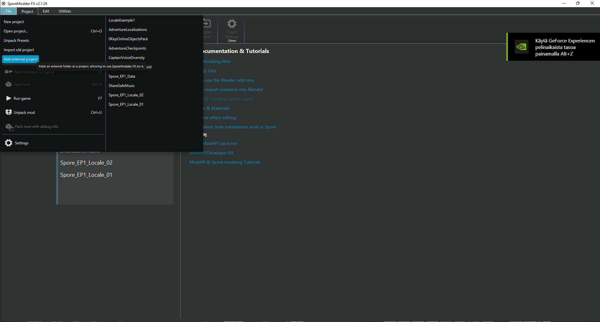

## Adventure examples for Adventure Localizer
There are 3 separate adventure PNGs included in this repository, as an example of what **Adventure Localizer** can do.
### Trooba Localization Test
This version of *Trooba - The Adventure Begins* has two separate localizations found in one adventure: Finnish (`fi-fi`) and English (`en-us`), which changes depending on game language. You can force the adventure to use either localization depending on game language by using the cheat `unlocalizeAdventure` while in the editor.

### Master of Time - Interlude
Adventure originally by Miikka64, this adventure sees the god of evolution Metartalius face his superiors after he left the heroes of the series (Josh's League) leave their field of vision. This iteration of the adventure is meant to showcase breaking the text limits of the adventure editor, and how the scripts still function despite being in the `mNonLocalizedText` field of the class responsible for adventure dialouge. There are two versions of this adventure: One with localization enabled (`Master of Time Interlude locale.png`), and another where `unlocalizeAdventure` has been used (`Master of Time Interlude Test.png`).

   ***NOTE: You will need to be online in the Spore servers in order to view this adventure properly!***

## How to use...
***You will need SporeModder FX for this!***
1. Import one of the example projects in the repository to SporeModder FX by selecting File->Add external project in the upper-left corner of SporeModder FX's window

2. Pack the mod by selecting File->Pack mod

3. Run Spore in windowed mode and drag the PNGs you want into the game window.
4. Load the adventure in your chosen game locale to see the localization in action. Enjoy!
