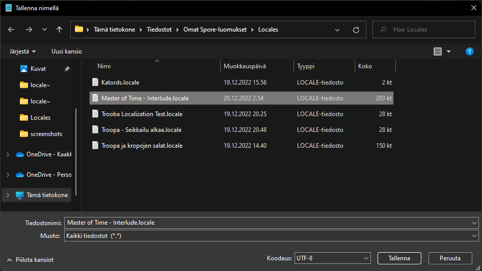
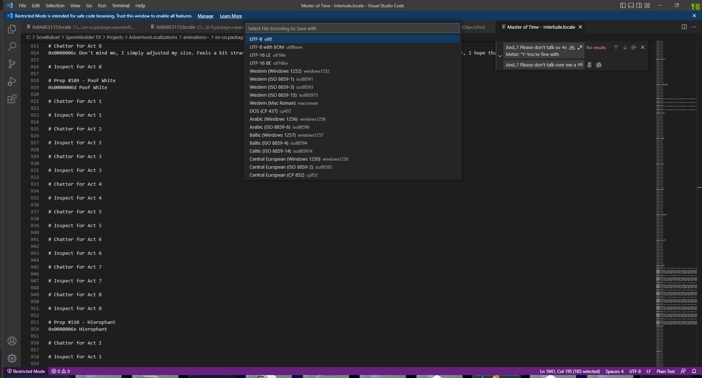

# Overview
**Adventure Localizer** is a tool for adventure creators to make use of the localization fields present for adventures in Spore: Galactic Adventures. It adds 3 different cheats that interact with adventure text and localization tables, allowing players to easily convert non-localized text into localized text, and vice versa.
* `LocalizeAdventure` - Saves adventure text into a locale file and inside adventures converts it into a format compatible with the now-created locale file. 
* `SaveAdventureLocale` - Saves adventure text into a locale file, but does not convert the adventure into a localized version. Good for transcribing adventures.
* `UnlocalizeAdventure` - Converts a localized adventure into an unlocalized version, allowing the adventure to be shared online without the locale file installed to the game. Doing this also allows for the usual 192 character limit to be bypassed, proved text fields are not edited afterwards.

***Spore ModAPI Launcher Kit is required to install and use this mod!***

Get Spore ModAPI Launcher Kit from here: http://davoonline.com/sporemodder/rob55rod/ModAPI/Public/

## Guides - How to...
### Create a localized adventure
***You will need:***
 * Text editor such as Notepad or Visual Studio Code
 * SporeModder FX
 * Spore ModAPI Launcher Kit and this mod installed to your game
1. Go to an adventure in the adventure editor. Press `CTRL+SHIFT+C` to open the cheat console after loading the adventure, and type in `localizeAdventure`. Press `ENTER`.

    ***NOTE: Make sure you have all the text you need in the adventure before typing this out, and that you have generally finished work in it!*** 
2. Save the adventure (preferably as new) and locate the `.locale` file with the same name as your adventure in `C:\\Users\[username]\Documents\My Spore Creations\Locales`.
3. Open the locale file with the text editor of your choosing. All of the adventure's text boxes' data should be there, stored safely.
   * Before we do anything with the file, it would be prudent to change the file's encoding from UTF-16 LS to UTF-8.
   * With Notepad, select *Save as...* from the upper-left corner of the window (or press `CTRL+SHIFT+S`), choose UTF-8 as encoding and save the file over its original version. You can also move this already to your SporeModder FX project if you so desire. 
    
   * With Visual Studio Code, you can select `UTF-16 LS` from the bottom-right corner of the window, select `Save with Encoding` from the appearing drop-down menu, and then choose `UTF-8` as your encoding. Your file will save automatically.
    
4. Complete any changes to the script you want to finish, and then save the file. Create a new project in SporeModder FX where you will place your `.locale` file.
 
    ***NOTE: If needed, line breaks in dialogues have to be replaced with `~br~`, which will do the line breaks for you in runtime.***
    
    ***NOTE 2: There are two choices as for how you want to format your project.***
    * If you have plans for translating the adventure into multiple languages, having the following file structure in your project would help:
        (`en-us` and `fi-fi` correspond to language locales Spore uses, check which language code your game uses and adjust accordingly)
        
    * If you no plans regarding translation, having this project layout is also fine (though not recommended in terms of compatibility):
    
5. Once you've done setting up your project in SporeModder FX, pack the mod and run the game again. Make sure the package has enough priority so it doesn't get overridden by other mods. If needed, set the package signature to `GA Patch 5.1` in the project settings inside SporeModder FX. 
    * Load the adventure you localized. It should display the new contents of your locale file inside the adventure, depending on the game's language.
6. Currently localized adventures cannot be shared to the official Spore servers. I mean, you *could* try, but all your players would see are a bunch of `***` characters, as they would need the mod you just created to view and play the adventure correctly.
    * If you are from the future where adventures are shared like mods through package files built by SporeModder FX (or any other package modding tool used during then), include the locale files alongside your adventure files and other stuff, in the same mod project.
    * For an offline creator who solely relies on PNGs for sharing, asking players to install this mod besides your localized adventure should prove no problem to you.

### Unlocalize a localized adventure
1. For this to work, install **Adventure Localizer** with the **Spore ModAPI Launcher Kit**.
2. Go to an adventure that has been localized (like a Maxis adventure included with the install of the game, or an adventure localized with the ``localizeAdventure`` cheat and with the relevant locale file loaded in-game), open it in editor, and press `CTRL+SHIFT+C` to open the cheat console after loading has completed. Type in ``unlocalizeAdventure`` and press ``ENTER``.
3. Save the adventure immediately afterwards (preferably as new if you need to do changes afterwards via the locale) and share it whichever method you prefer. Players will no longer need a locale file to view the adventure correctly, and as a bonus, text strings also don't comply to the 192 character limit imposed by the input fields of the adventure editor. Thus this will likely be the main thing you use this mod and localization in general for if, say, you share adventures to the official Spore servers.

### Save a locale file without modifying the adventure
1. Go to an adventure in the adventure editor. Press `CTRL+SHIFT+C` to open the cheat console after loading the adventure, and type in `SaveAdventureLocale`. Press `ENTER`.
2. A locale file of the adventure will be saved as if you just used ``localizeAdventure``, but the adventure itself is not modified to adjust with that. This option is good if all you needed was a reference or a transcript of the dialogue boxes found in the adventure itself for archival/research purposes.

## Credits
* [Liskomato/Tenderi4](https://github.com/Tenderi4) - Creating and coding the cheats, formatting and execution
* [Auntie Owl/Plencka](https://github.com/plencka) - Concept for localizing adventures and packing them into `.package` files.
* [Miikka64](http://www.spore.com/view/myspore/Miikka64) - Creator of *Master of Time - Interlude*, one of the adventures used in the testing of this mod.

**Special thanks to:**
* [Emd4600](https://github.com/emd4600) - Creating the Spore ModAPI and overall research into Spore's code
* [Kade](https://github.com/Spore-Community) - Analyzing Spore file formats and data
* [VanillaCold](https://github.com/VanillaCold) & [Zarklord](https://github.com/Zarklord) - Helping out with the bugs on this project
